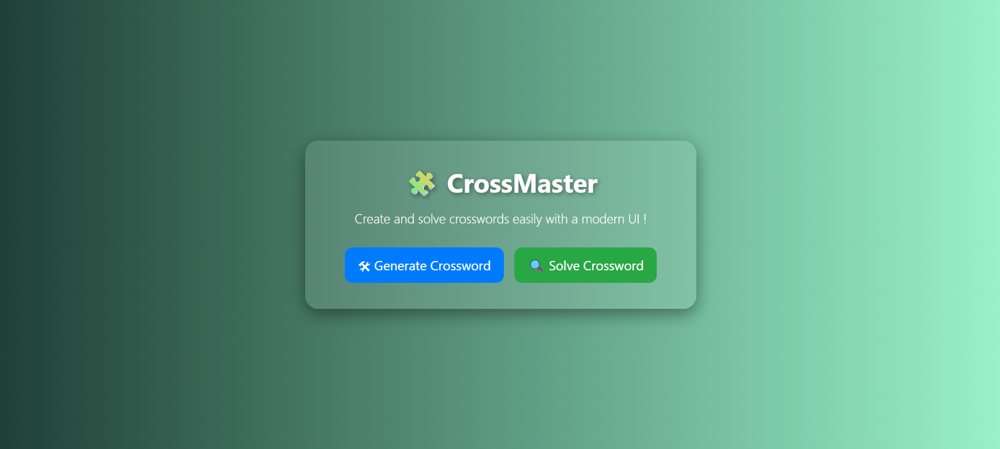
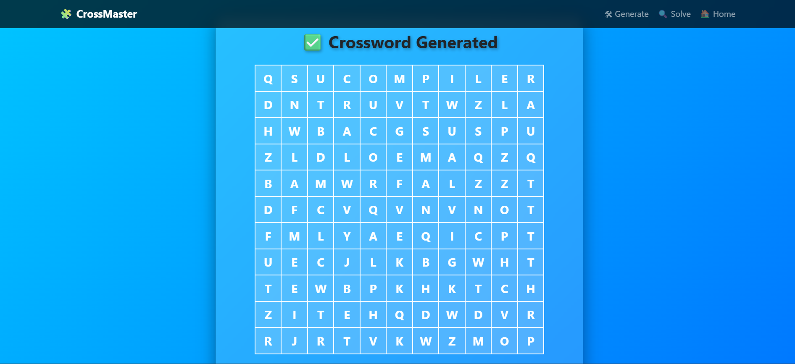
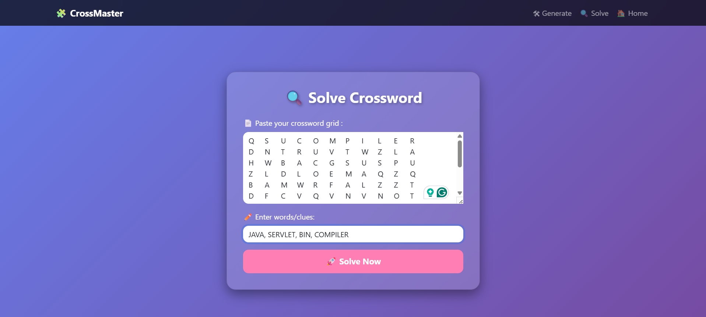
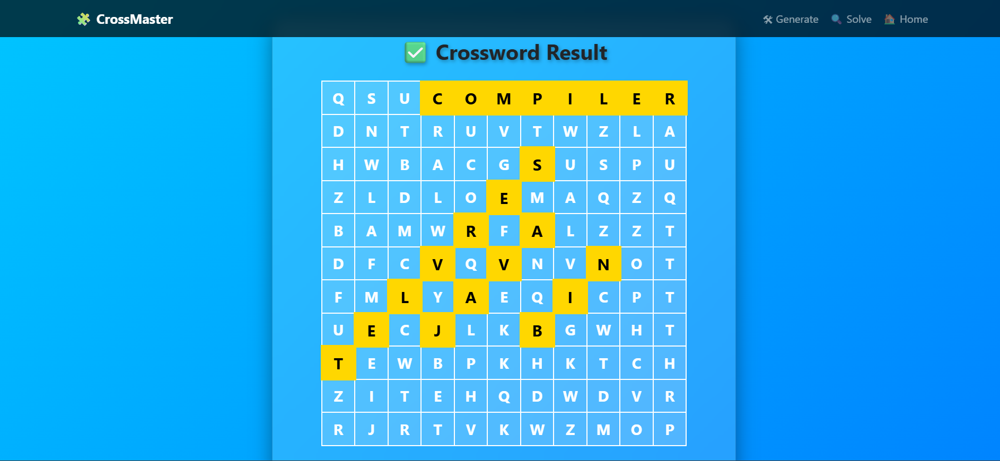

<h1 align="center">🧩 CrossMaster</h1>
<h3 align="center">A Dynamic Crossword Generator & Solver Web Application using Java Servlets</h3>

<p align="center">
  
  
  
</p>


---

## 🌟 Overview  
**CrossMaster** is a **web-based Crossword Generator & Solver** built using **Java Servlets, JSP, and Maven**.  
This project allows users to:  
✅ **Generate random crossword grids** from words you provide.  
✅ **Solve word search puzzles** with automatic **highlighting & positions**.  
✅ Simple and elegant **Bootstrap UI** for easy interaction.  

🚀 Perfect for **Java Web Development practice** and portfolio showcase!  

---

## ✨ Features  
- 🛠 **Generate Crossword** dynamically with random letters filled in.  
- 🔍 **Solve Word Search Puzzles** by entering grid & words.  
- 🎨 **Highlight matching words** in the grid with positions.  
- 💻 Built using **Java Servlets + JSP (Tomcat)**.  
- 🎯 Responsive UI powered by **Bootstrap 5**.  

---

## 🖼️ Screenshots  

| 🏠 Home Page | 🛠 Generate Crossword | 🔍 Solve Crossword | ✅ Solved Crossword (Highlighted Words) |
|--------------|----------------------|-------------------|-----------------------------------------|
|  |  |  |  |


---

## 🛠 Tech Stack  
- **Frontend:** HTML5, CSS3, Bootstrap 5  
- **Backend:** Java Servlets (JSP)  
- **Server:** Apache Tomcat 10+  
- **Build Tool:** Maven  
- **Version Control:** Git & GitHub  

 
---

## ⚡ Setup Instructions 

### 1️⃣ Clone the Repository

```bash
git clone https://github.com/your-username/crossmaster.git
cd crossmaster
```

---

### 2️⃣ Build the Project

```bash
mvn clean install
```

---

### 3️⃣ Deploy on Tomcat

- Copy the generated WAR file from the target/ folder to your Tomcat webapps/ directory.
- Start Tomcat server and access the app:

```bash
http://localhost:8080/crossmaster
```

---

<details>
<summary>📁 Project Structure (Click to expand)</summary>

<pre>
crossmaster/
│
├── src/main/
│   ├── java/com/crossword/servlets/
│   │    ├── GenerateCrosswordServlet.java
│   │    ├── SolveCrosswordServlet.java
│   │
│   ├── webapp/
│   │    ├── index.jsp
│   │    ├── generate.jsp
│   │    ├── solve.jsp
│   │    ├── result.jsp
│
├── pom.xml
└── README.md
</pre>

</details>

---

## 🙌 Acknowledgements

- 📜 Servlet & JSP Docs from [Jakarta EE Documentation](https://jakarta.ee/specifications/servlet/)
- 🎨 UI Design Inspiration from [Bootstrap Docs](https://getbootstrap.com/)
- ✨ UI Icons & Graphics from [Flaticon](https://www.flaticon.com/)

---


### 👨‍💻 Author

👨‍💻 Made with ❤️ by [Keshav](https://github.com/keshav-codess)


If you liked this project, consider ⭐ starring the repo and sharing it — _it helps a lot!_


